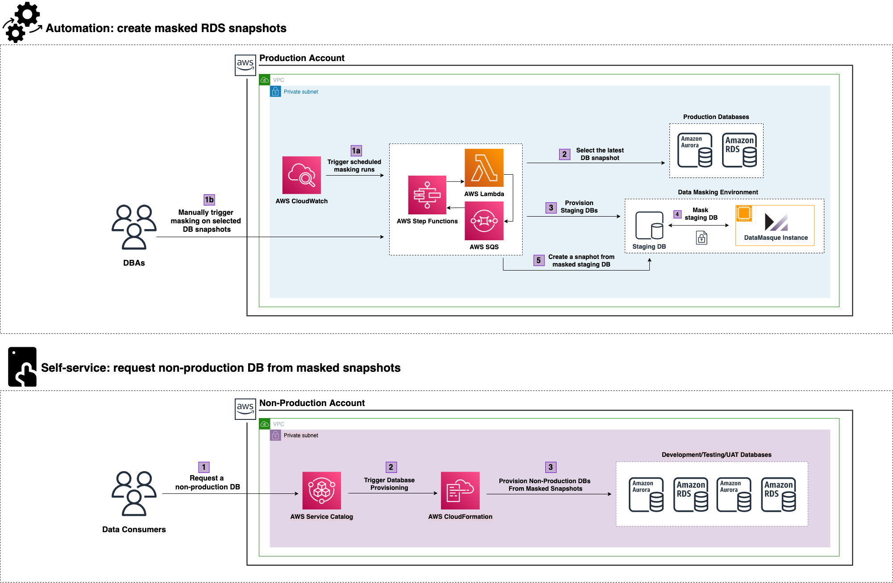

# AWS Service Catalog RDS Provisioning Template

## Introduction

DataMasque AWS blueprint template is written in AWS CloudFormation format. The purpose of this template is to create a reusable data provisioning pipeline that calls DataMasque APIs to produce masked data that's safe for consumption in non-production environment.

The diagram below describes the DataMasque reference architecture in AWS.  This CloudFormation template is used to setup an AWS Service Catalog Product to give end users access to provision RDS instances from a masked RDS snapshot - this incoporiates steps 6, 7 & 8 highlighted in purple.  Please refer to [DataMasque AWS Masking Step Functions CloudFormation Template](https://github.com/datamasque/DataMasque-AWS-masking-stepfunctions-blueprint) to automate creation of masked RDS/Aurora snapshots.

## Step-by-step
Follow the steps below to create AWS Service Catalog product using this CloudFormation template:

1. Download this AWS CloudFormation Template
2. Update the AWS CloudFormation Template to use `Default` to specify  your configurations for End Users.  
2. Create an [AWS Service Catalog Portfolio](https://docs.aws.amazon.com/servicecatalog/latest/adminguide/getstarted-portfolio.html).
3. Create an [AWS Service Catalog Product](https://docs.aws.amazon.com/servicecatalog/latest/adminguide/getstarted-product.html).
4. Create an [IAM group for End Users to launch products](https://docs.aws.amazon.com/servicecatalog/latest/adminguide/getstarted-iamenduser.html).
5. Grant [End Users access to the Portfolio](https://docs.aws.amazon.com/servicecatalog/latest/adminguide/getstarted-deploy.html).
6. Test the [newly setup product to test the End User experience](https://docs.aws.amazon.com/servicecatalog/latest/adminguide/getstarted-verify.html).

Reference: https://docs.aws.amazon.com/servicecatalog/latest/adminguide/getstarted.html

## Parameters

| Parameter              | Description                                                             |
|------------------------|-------------------------------------------------------------------------|
| DBSnapshotIdentifier   | The masked snapshot that will be used to provision the new RDS instance |
| DBInstanceClass        | Instance class for the new RDS instance.                                |
| DBInstanceIdentifier   | RDS instance identifier.                                                |
| OptionGroupName        | RDS instance Option Group.                                              |
| DBParameterGroupName   | RDS instance Parameter Group.                                           |
| DBSubnetGroupName      | RDS instance Subnet Group.                                              |
| AvailabilityZone       | RDS Availability Zone.                                                  |
| VPCSecurityGroups      | RDS Security Group.                                                     |

## Notes

- The **AWS Service Catalog RDS Provisioning template** should be used as a provisioning method of a **DataMasque** masked snapshot.
- **The parameters** to the created AWS Service Catalog products **need reflect your setup** and **preferred configurations** within your AWS Environment.
