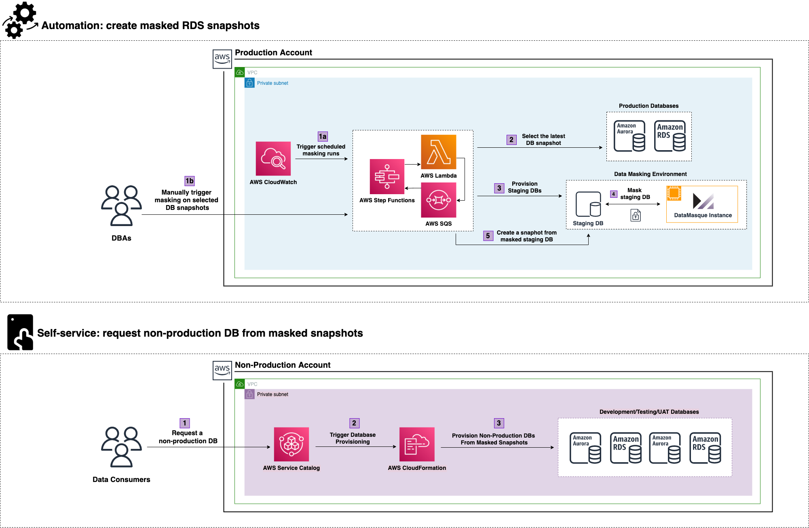

# AWS Service Catalog Database Provisioning Blueprint

> **Reference blueprint — adapt to your environment.** This repository is a
> starting point, not a turnkey product. Review and harden IAM, networking,
> secrets, and TLS for your own environment before any production use.

[DataMasque](https://datamasque.com) replaces sensitive data with synthetically
identical customer data so teams can work with production-like data without
exposing PII. This blueprint provisions **masked** RDS or Aurora databases through **AWS
Service Catalog**: it publishes a self-service product whose only selectable
snapshots are the masked snapshots produced by the
[RDS masking blueprint](https://github.com/datamasque/DataMasque-AWS-RDS-masking-stepfunctions-blueprint).
End users launch the product to restore a fresh database from a masked snapshot,
so non-production environments never receive raw production data.

**Learn more:** [datamasque.com](https://datamasque.com) ·
[Product docs](https://datamasque.com/portal/documentation/) ·
[Book a demo](https://datamasque.com/request-a-demo)

---

A scheduled Lambda keeps the Service Catalog product's snapshot list current by
reading the available masked snapshots and re-publishing the provisioning
template. The schedule ships disabled (`Enabled: False` in `template.yaml`); set
it to `Enabled: True` after deployment to refresh the snapshot list daily. This
blueprint provisions databases from already-masked snapshots; it does not itself
call the DataMasque API.



The diagram above shows the DataMasque reference architecture in AWS. This
blueprint covers the **self-service provisioning** steps highlighted in purple.

## RDS vs Aurora

This repository ships two branches:

- `main-rds` — provisions a standalone **RDS DB instance** from a masked DB
  snapshot (this branch).
- `main-aurora` — provisions an **Aurora cluster + instance** from a masked DB
  cluster snapshot. Check it out with `git checkout main-aurora`.

For masking the source snapshots first, see the
[AWS RDS masking (Step Functions) blueprint](https://github.com/datamasque/DataMasque-AWS-RDS-masking-stepfunctions-blueprint).

## Prerequisites

- An AWS account with permission to create Service Catalog portfolios/products,
  IAM roles, S3 buckets, and Lambda functions.
- The [AWS SAM CLI](https://docs.aws.amazon.com/serverless-application-model/latest/developerguide/install-sam-cli.html).
- At least one **masked** RDS DB snapshot (or DB cluster snapshot on Aurora)
  already produced by the RDS masking blueprint.

## Deploy

This is an AWS SAM application. Build and deploy it with the SAM CLI:

```bash
sam build
sam deploy --guided
```

`sam deploy --guided` prompts for the stack name, region, and the deployer
parameters below, then provisions the Service Catalog portfolio, product, S3
template bucket, and the update Lambda.

### Deployer parameters (template.yaml)

| Parameter             | Description                                                                 | Default                              |
|-----------------------|-----------------------------------------------------------------------------|--------------------------------------|
| `SourceTemplateURL`   | URL of the provisioning template the update Lambda fetches and re-publishes. | _(required)_                         |
| `RDSIdentifier`       | Source RDS DB instance / Aurora cluster identifier whose masked snapshots feed the product. | _(required)_         |
| `TemplateBucketName`  | Globally-unique name for the S3 bucket holding published templates.          | `datamasque-servicecatalog-templates`|
| `PortfolioName`       | Service Catalog portfolio display name.                                      | `DatamasquePortfolio`                |
| `ProductName`         | Service Catalog product name.                                                | `DatamasqueRDSProvisioning`          |

> `TemplateBucketName` must be globally unique across all AWS accounts. Override
> the default to avoid collisions.

## End-user provisioning parameters

End users launching the Service Catalog product supply the parameters consumed
by `RDSDBInstance.template`:

| Parameter              | Description                                                             |
|------------------------|-------------------------------------------------------------------------|
| DBSnapshotIdentifier   | The masked snapshot used to provision the new RDS instance.             |
| DBInstanceClass        | Instance class for the new RDS instance.                                |
| DBInstanceIdentifier   | RDS instance identifier.                                                |
| OptionGroupName        | RDS instance Option Group.                                              |
| DBParameterGroupName   | RDS instance Parameter Group.                                           |
| DBSubnetGroupName      | RDS instance Subnet Group.                                              |
| AvailabilityZone       | RDS Availability Zone.                                                  |
| VPCSecurityGroups      | RDS Security Group.                                                     |

## After deploying: end-user IAM access

The stack creates the portfolio and product but does **not** grant anyone
access to launch them. To let end users self-serve, they need three things:

1. **Service Catalog end-user permissions** — attach the AWS managed policy
   [`AWSServiceCatalogEndUserFullAccess`](https://docs.aws.amazon.com/servicecatalog/latest/adminguide/controlling_access.html)
   to the end users' IAM group/role. This grants the `servicecatalog:*` and
   `cloudformation:*` actions needed to browse and provision products.
2. **Portfolio access** — associate that IAM group/role with the deployed
   portfolio (Service Catalog console → Portfolios → *Access* tab, or
   `aws servicecatalog associate-principal-with-portfolio`). The portfolio ID
   is in the stack's `ServiceCatalogPortfolioId` output.
3. **Permissions for the provisioned resources** — this blueprint ships
   **without a launch constraint**, so provisioning runs with the *end user's
   own* credentials. Users therefore also need IAM permissions for what the
   template creates, at minimum:
   `rds:RestoreDBInstanceFromDBSnapshot`, `rds:DescribeDBInstances`,
   `rds:DescribeDBSnapshots`, `rds:CreateTags`, `rds:DeleteDBInstance`
   (for terminate), and the `ec2:Describe*` calls RDS makes for subnet/security
   group placement.

   Alternatively, add a
   [launch constraint](https://docs.aws.amazon.com/servicecatalog/latest/adminguide/constraints-launch.html)
   with a role holding those RDS/EC2 permissions; end users then only need
   items 1 and 2, which is the recommended least-privilege setup.

Reference walkthrough: <https://docs.aws.amazon.com/servicecatalog/latest/adminguide/getstarted.html>

## Notes

- Use this product as the provisioning method for a **DataMasque** masked
  snapshot.
- The provisioning parameters **need to reflect your setup** and **preferred
  configuration** within your AWS environment.

---

## Related DataMasque blueprints

- [AWS RDS masking (Step Functions)](https://github.com/datamasque/DataMasque-AWS-RDS-masking-stepfunctions-blueprint)
- [Azure DB masking (Logic Apps)](https://github.com/datamasque/DataMasque-Azure-DB-masking-logicapps-blueprint)
- [AWS Cross-Account Bucket Access](https://github.com/datamasque/DataMasque-AWS-Cross-Account-Bucket-Access)
- [AWS ECS Deployment](https://github.com/datamasque/DataMasque-AWS-ECS-Deployment)
- [masque-bricks (Databricks)](https://github.com/datamasque/masque-bricks)
